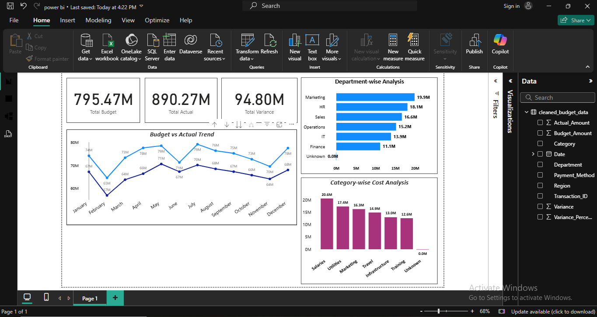

# Budget vs Actual Analysis Project

## Overview

This project analyzes budget vs actual financial data to identify overspending patterns and key cost drivers.

## Tools Used

* Python (Data Cleaning)
* SQL (Data Analysis)
* Power BI (Dashboard)

## Dataset

The dataset contains:

* Date
* Department
* Category
* Budget Amount
* Actual Amount
* Variance

## Key Analysis

* Department-wise overspending
* Category-wise cost analysis
* Monthly trend analysis

## Dashboard

## Insights

* Some departments exceeded their budgets significantly
* Salaries were the highest cost driver
* Spending trends fluctuated across months

## Conclusion

This analysis helps in improving financial planning and cost control.

Made by Sonali
